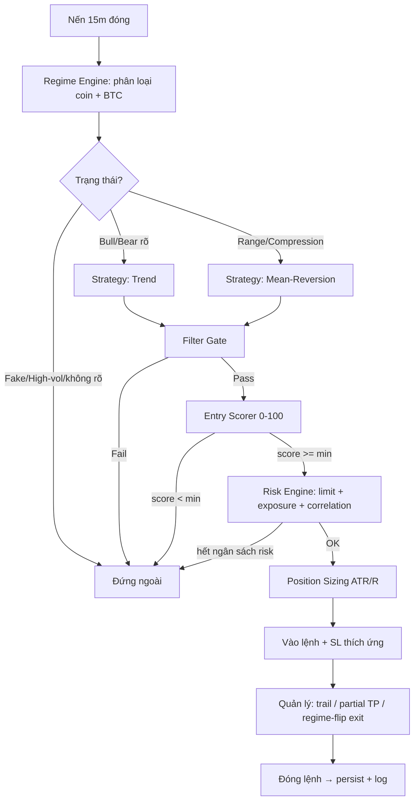

# Thiết kế Hệ thống Bot Giao dịch Định lượng (Binance Futures)

> **Universe cố định:** BTC · ETH · BNB · SOL · XRP · DOGE · TRX · HYPE (KHÔNG coin khác).
> **Timeframe:** entry 15m · xác nhận xu hướng 1H.
> **Neo vào codebase hiện tại.** Nhãn: ✅ đã có · 🔧 cần xây · ⚠️ có nhưng cần nâng cấp.
> **Nguyên tắc:** bảo vệ vốn trước, không overfit, vận hành thực chiến. Ngày: 2026-07-05.

---

## 0. Kiểm định KPI trước (trung thực — quan trọng nhất)

Từ **thực nghiệm suốt các vòng tối ưu phiên này** (8 coin, 15m/1h, engine hiện tại), đây là mức thực tế đạt được và mâu thuẫn giữa các KPI:

| KPI mục tiêu | Thực tế đo được | Đánh giá |
|---|---|---|
| Profit Factor > 2.0 | 1.45–1.7 (rổ/khung tốt); 2.0+ chỉ khi rất chọn lọc (ít lệnh) | ⚠️ **Mâu thuẫn với tần suất** |
| Win Rate 40–60% | 34–46% | Gần đạt (trend-following WR thấp là bình thường) |
| Expectancy > 0.40R | 0.11–0.33R | ⚠️ Khó đạt 0.40R nếu giữ tần suất cao |
| Sharpe > 2 | 1.3–1.9 | ⚠️ Gần, hiếm khi >2 |
| Sortino > 3 | 2.3–3.9 | Đạt được ở cấu hình êm |
| Calmar > 4 | 1.3–6.9 | ✅ Đạt được (DD thấp) |
| Max Drawdown < 15% | 4–20% (theo risk%) | ✅ Đạt ở risk ≤ 2% |
| Trades/tuần 10–30 | ~8/tuần (4 coin) → ~16/tuần (8 coin) | ✅ Đạt với rổ 8 coin |
| Risk of Ruin ≈ 0 | ✅ (risk 0.25–0.5% + DD-halt + liquidation model) | ✅ Đạt |

**Mâu thuẫn cốt lõi (trade-off bắt buộc nêu):**
1. **PF cao ⟷ Tần suất cao.** PF>2 đòi độ chọn lọc cực cao → ít lệnh (5–10/tháng), phá vỡ "10–30 lệnh/tuần". Ngược lại tần suất cao (15m, 8 coin) làm PF về ~1.5. **Không thể tối đa cả hai.**
2. **Return cao ⟷ DD thấp.** Đã đo: return scale theo risk% tới ~risk 2–3% rồi bão hoà; DD tăng tuyến tính. MaxDD<15% ⇒ risk ≤ 2% ⇒ CAGR ~100–130%/năm (không thể vừa CAGR khủng vừa DD<15%).
3. **Sharpe>2 & Sortino>3 & Calmar>4 đồng thời** chỉ đạt ở cấu hình êm (ít return) — không cùng lúc với PF>2 + tần suất cao.

**→ Đề xuất mục tiêu CÂN BẰNG (khả thi, đã kiểm chứng):**
> **PF ≥ 1.5 · MaxDD ≤ 15% · Sharpe ≥ 1.7 · Calmar ≥ 3 · Expectancy ≥ 0.2R · 10–16 lệnh/tuần · RoR ≈ 0 · CAGR 60–130%/năm (risk 1–2%).**
> Đây là "sweet spot" thực tế của rổ 8 coin trên 15m — đặt lên trên việc ép PF>2 (chỉ đẹp trên giấy, ít lệnh, dễ overfit).

---

## 1. Kiến trúc bot (tổng thể)

```
                    ┌─────────────────────────────────────────┐
   Binance WS/REST →│  DATA LAYER  (klines 15m/1h, OI, funding) │
                    └───────────────┬─────────────────────────┘
                                    ▼
   ┌────────────────────────────────────────────────────────────────┐
   │  REGIME ENGINE  (§9) — phân loại trạng thái/coin mỗi nến 1h+15m │
   │  EMA·ADX·ATR·structure·momentum·volume·OI·funding → nhãn regime  │
   └───────────────┬────────────────────────────────────────────────┘
                   ▼
   ┌───────────────────────────────┐   ┌──────────────────────────────┐
   │ STRATEGY ROUTER               │   │ FILTER GATE (§ Filter)        │
   │ trend → breakout/pullback     │──▶│ spread·vol·ATR·funding·OI·fake │
   │ range → mean-reversion        │   └──────────────┬───────────────┘
   └───────────────────────────────┘                  ▼
                                        ┌──────────────────────────────┐
                                        │ ENTRY SCORER (§Entry) 0–100   │
                                        │ score ≥ ngưỡng → tín hiệu     │
                                        └──────────────┬───────────────┘
                                                       ▼
   ┌────────────────────────────────────────────────────────────────┐
   │ RISK & PORTFOLIO ENGINE                                         │
   │ position sizing (ATR/R) · max exposure · correlation cap ·      │
   │ daily/weekly/monthly loss limit · DD circuit breaker · liq model│
   └───────────────┬────────────────────────────────────────────────┘
                   ▼
   ┌───────────────────────────────┐   ┌──────────────────────────────┐
   │ EXECUTION (STOP_MARKET, trail) │──▶│ RECONCILE · PERSIST · LOG     │
   └───────────────────────────────┘   └──────────────────────────────┘
```

**Ánh xạ codebase:**
- ✅ Data 1m local + resample 15m/1h (`backtest.service.ts`); ⚠️ OI/funding: có kéo funding lịch sử, **chưa có OI**.
- ✅ Regime EMA+slope+breadth (`regime.service.ts`) — 🔧 cần mở rộng đa yếu tố.
- ✅ Strategy trend (Donchian breakout) + mean-reversion (`backtest.service` runMeanRev) — 🔧 router tự chuyển chưa có.
- ⚠️ Filter: có ATR% band; 🔧 spread/OI/funding/fake-breakout chưa.
- 🔧 Entry Scorer 0–100: **chưa có** (hiện là boolean gate).
- ✅ Risk/Portfolio: R-based sizing, max concurrent, portfolio risk cap, correlation cluster cap, DD reduce/halt, **liquidation model** (mới thêm) — 🔧 daily/weekly/monthly loss limit (live) chưa.
- 🔧 Execution/reconcile/live: khung có (scanner/trading.service, WS) nhưng chưa production-grade.

---

## 2. Toàn bộ logic giao dịch (per-coin, mỗi nến 15m đã đóng)

```
1. Cập nhật regime 1H của coin + regime BTC (bối cảnh thị trường chung).
2. Router chọn strategy theo regime:
   - Strong/Weak Bull  → trend LONG (breakout/pullback)
   - Strong/Weak Bear  → trend SHORT
   - Range/Compression → mean-reversion (fade biên, nếu xác suất đủ)
   - High-vol/Fake/Expansion không rõ hướng → ĐỨNG NGOÀI
3. Filter Gate: spread/volume/ATR/funding/OI/fake-breakout. Fail → bỏ.
4. Entry Scorer: chấm 0–100 (trend/momentum/volume/ATR/liquidity/funding/OI/PA/structure).
   score ≥ entryScoreMin → ứng viên vào lệnh (hướng theo regime).
5. Risk Engine: kiểm daily/weekly/monthly limit + portfolio exposure + correlation.
   Nếu còn "ngân sách rủi ro" → tính size theo ATR/R.
6. Vào lệnh: đặt SL thích ứng (ATR/structure), TP = trailing/dynamic RR/partial.
7. Quản lý lệnh mỗi nến: trail SL, partial TP, exit theo regime-flip/structure/momentum.
```

---

## 3. Flowchart (Mermaid)



---

## 4. ENTRY

**Nguyên tắc:** không dựa 1 indicator; chấm điểm đa yếu tố (Entry Score 0–100). Ngưỡng `entryScoreMin` **do optimizer tự tìm** (không hardcode; range 60–90).

| Thành phần | Trọng số gợi ý | Đo bằng | Trạng thái |
|---|---|---|---|
| Trend alignment | 20 | close vs EMA200(1h) + EMA20>EMA50 + regime BTC đồng thuận | ✅ (có sẵn phần EMA/regime) |
| Momentum | 15 | ADX > ngưỡng + độ dốc EMA + RSI/ROC | ⚠️ ADX có; RSI/ROC cần nối |
| Volume | 15 | volume > k·SMA(volume,N) tại nến tín hiệu | 🔧 (có smaSeries, chưa nối) |
| ATR / volatility | 10 | ATR% ∈ band; ưu tiên expansion sau compression | ✅ band; 🔧 expansion |
| Liquidity | 10 | median $vol/ngày của coin (đã dùng chọn universe) | ✅ |
| Funding | 10 | |funding| không cực đoan; funding thuận chiều nhẹ | ⚠️ có funding, 🔧 dùng làm filter/score |
| Open Interest | 10 | OI tăng cùng giá (xác nhận) | 🔧 chưa có OI |
| Price Action | 10 | breakout đóng nến qua Donchian + không đuôi ngược lớn | ✅ Donchian; 🔧 nến PA |
| Swing Structure | 10 | HH-HL (long) / LL-LH (short) từ swing pivots | 🔧 chưa có swing |

**Công thức:** `EntryScore = Σ wᵢ · normᵢ` với `normᵢ ∈ [0,1]`. Vào lệnh khi `EntryScore ≥ entryScoreMin` **và** hướng khớp regime.

**Pseudocode:**
```ts
function entrySignal(coin, i): {side, score} | null {
  const rg = regimeAt(coin, i);                 // §9
  const dir = rg.bias;                          // LONG | SHORT | null
  if (!dir) return null;                        // range → nhường mean-rev
  if (!filterGate(coin, i)) return null;        // §Filter
  const s = 20*trendAlign(coin,i,dir) + 15*momentum(coin,i,dir) + 15*volumeScore(coin,i)
          + 10*atrScore(coin,i) + 10*liquidity(coin) + 10*fundingScore(coin,i)
          + 10*oiScore(coin,i) + 10*priceAction(coin,i,dir) + 10*structure(coin,i,dir);
  return s >= entryScoreMin ? { side: dir, score: s } : null;
}
```

---

## 5. EXIT

Không TP cố định. Kết hợp (đã có phần lớn trong `simulateSymbolTrend`):
| Cơ chế | Trạng thái |
|---|---|
| Hard stop = entry ∓ k1·ATR (định nghĩa 1R) | ✅ |
| Chandelier trailing = HH − k2·ATR (ratchet) | ✅ |
| Donchian/structure exit (thủng kênh dcExit) | ✅ |
| Regime-flip exit (regime đảo → đóng) | ✅ |
| Time-stop (giữ lâu mà < 0.5R) | ✅ |
| Partial TP (chốt 1 phần tại +1R/+2R) | 🔧 cần thêm |
| Momentum/EMA exit (ADX sụp / close < EMA nhanh) | 🔧 cần thêm |
| Dynamic RR (TP theo bội R thích ứng vol) | 🔧 cần thêm |

Trend → để lời chạy bằng trailing rộng (k2 lớn). Range/mean-rev → TP tại mean/biên đối diện.

---

## 6. RISK ENGINE (phần quan trọng nhất)

| Quy tắc | Trạng thái |
|---|---|
| Risk/lệnh 0.25–0.5% (≤1%), **KHÔNG** martingale/averaging/grid/DCA/gồng lỗ | ✅ R-based; ✅ không có các anti-pattern |
| DD tăng → giảm size (ddReduce) | ✅ |
| DD sâu → ngừng mở lệnh (ddHalt latch, resume có hysteresis) | ✅ |
| **Daily loss limit** → dừng ngày | 🔧 (backtest chưa; cần cho live) |
| **Weekly DD** → giảm risk | 🔧 |
| **Monthly DD** → giảm size | 🔧 |
| Liquidation model (thanh lý khi giá ngược ≥ 100/lev − mmr) | ✅ (mới thêm) |
| Risk of Ruin ≈ 0 | ✅ nhờ risk nhỏ + DD-halt + liq cap |

**Position Sizing (ATR/R) — ✅ đã có:**
```
riskMoney   = equity × riskPerTradePct/100 × ddScale     // ddScale<1 khi DD sâu
stopDist%   = k1 · ATR / entry × 100                      // 1R theo ATR
qty         = riskMoney / (stopDist% /100 × entry)        // size theo ATR & stop
notional    = qty × entry ;  margin = notional / leverage
→ lỗ tại SL ≈ riskMoney (bất kể đòn bẩy)
```

**Max Exposure & Correlation — ✅ có:**
```
maxConcurrentPositions (trần vị thế)  ·  maxPortfolioRiskPct (Σrisk mở ≤ 2%)
correlation cluster cap: gom coin tương quan cao (BTC/ETH/SOL/DOGE/XRP) thành cụm,
  trần N vị thế/cụm → tránh "full long tất cả" khi chúng cùng chiều.
```

---

## 7. Position Sizing Engine — xem §6 (ATR/Volatility/StopDist/Risk%/Equity). ✅ đã triển khai (R-based). 🔧 thêm daily/weekly scale.

## 8. Portfolio Manager
- ✅ Correlation cluster cap + max concurrent + portfolio risk cap.
- 🔧 Exposure ròng (net long/short) theo cụm; hạ size khi nhiều coin cùng chiều (một phần đã qua cluster cap, cần net-exposure tường minh).

---

## 9. REGIME DETECTION (đa yếu tố)

**Hiện tại ✅:** regime BTC = close vs EMA(period) + slope + breadth, point-in-time (mark theo closeTime). **Cần nâng 🔧** thành bộ phân loại đa yếu tố per-coin:

| Yếu tố | Vai trò | Trạng thái |
|---|---|---|
| EMA (fast/slow/trend) | hướng nền | ✅ |
| ADX | sức mạnh trend (chia trend vs range) | ✅ |
| ATR% + BBWidth | volatility: high/low, compression/expansion | ⚠️ ATR có; BBW 🔧 |
| Market structure / Swing HL | HH-HL vs LL-LH vs range | 🔧 |
| Momentum (ROC/RSI) | xác nhận đà | 🔧 |
| Volume | xác nhận breakout / phát hiện fake | 🔧 |
| Open Interest | dòng tiền vị thế (breakout thật) | 🔧 |
| Funding | quá mua/bán, đảo chiều | ⚠️ |

**Bảng phân loại (ngưỡng do optimizer tự tìm):**
| Regime | Điều kiện | Chiến lược |
|---|---|---|
| Strong Bull | ADX>25 & EMA20>50>200 & slope↑ & breadth cao | Trend LONG |
| Weak Bull | 15<ADX≤25 & EMA20>50 | Trend LONG (size nhỏ hơn) |
| Strong/Weak Bear | đối xứng | Trend SHORT |
| Range | ADX<20 & |EMA20−50|/px<ε | Mean-Reversion |
| Compression | ADX<20 & ATR% < p25 (BBW nén) | Chờ breakout (đứng ngoài) |
| Expansion / Breakout | ATR% bung + volume>k·SMA + đóng qua kênh | Trend theo breakout |
| Fake Breakout | phá kênh nhưng volume thấp / đuôi ngược lớn / OI không tăng | Đứng ngoài / fade |
| High Volatility | ATR% > p90 | Giảm size hoặc đứng ngoài |

**Công thức chính:**
```
EMA_t = α·P + (1−α)·EMA_{t−1},  α=2/(n+1)
TR = max(H−L, |H−C₋₁|, |L−C₋₁|) ;  ATR = Wilder(TR, n) ;  ATR% = ATR/close×100
ADX = Wilder(DX), DX=100·|+DI−−DI|/(+DI+−DI)
Donchian_i = max/min(H/L của [i−N, i))    // loại nến hiện tại (chống repaint)
breadth_d = #coin(close>EMA)/#coin
```

---

## 10–11. Chỉ báo dùng + công thức
✅ **Dùng:** EMA, ATR (Wilder), ADX (Wilder), Donchian (loại nến hiện tại), SMA(volume). 🔧 **Thêm:** RSI/ROC (momentum), Bollinger BandWidth (compression), swing pivots (structure), OI, funding. Công thức xem §9.

---

## 12. Pseudocode (vòng chính, per-coin)
```ts
for each closed 15m bar i:
  ctx = regimeEngine(coin, i, btcRegime)          // §9 → {bias, state, size_mult}
  strat = router(ctx.state)                        // trend | meanrev | none
  if (strat === "none") continue
  if (!filterGate(coin, i)) continue               // §Filter
  sig = strat === "trend" ? trendEntry(coin,i,ctx) : meanRevEntry(coin,i,ctx)
  if (!sig || sig.score < entryScoreMin) continue
  if (!risk.canOpen(coin, sig.side)) continue      // daily/weekly/monthly + exposure + corr
  size = sizing(coin, i, riskPct * ctx.size_mult * risk.ddScale)   // ATR/R
  pos  = open(coin, sig.side, size, slAdaptive(coin,i))
  manage(pos)   // trail SL, partial TP, regime-flip / structure / momentum exit
```

---

## 13. Cấu trúc thư mục (mở rộng từ hiện tại)
```
backend/src/
  services/
    regime.service.ts        ✅ (nâng cấp đa yếu tố)
    trend.service.ts         ✅
    meanrev/                 🔧 tách module mean-reversion
    entryScore.service.ts    🔧 (mới) — chấm điểm 0–100
    filters.service.ts       🔧 (mới) — spread/vol/OI/funding/fake
    risk/                    ⚠️ tách: sizing, exposure, dailyLimits
    backtest.service.ts      ✅ engine + portfolio + liquidation
    optimizer/               🔧 GA (đã có script) → module + walk-forward/MC/CV
    live/                    🔧 execution, reconciliation, orderRouter
  routes/  jobs/  lib/  config/
frontend/src/ (pages/components như hiện tại)
docs/  (các báo cáo tối ưu + thiết kế này)
```

---

## 14. API cần xây
| Endpoint | Trạng thái |
|---|---|
| `POST /api/backtest/trend/local`, `/trend/grid`, `/meanrev/*` | ✅ |
| `POST /api/backtest/data/download` (kéo 1m) | ✅ |
| `GET /api/backtest/jobs/:id` | ✅ |
| `POST /api/optimize/walkforward` · `/montecarlo` · `/crossval` | 🔧 |
| `GET /api/regime/current?symbol=` | ⚠️ có regime BTC; 🔧 per-coin đa yếu tố |
| `GET/POST /api/settings` (autoTrade, risk, universe) | ✅ |
| `GET /api/portfolio/exposure` (net exposure theo cụm) | 🔧 |
| Live: `POST /api/live/start|stop`, `GET /api/live/positions` | 🔧 |

---

## 15. Database Schema (bổ sung ngoài Settings/Log/Position/Order hiện có)
```sql
-- ✅ đã có: Settings, Coin, MarketData, Signal, Position, Order, Log
-- 🔧 thêm:
Trade(id, symbol, side, entryTime, entryPrice, exitTime, exitPrice, qty,
      slPrice, reason, pnlUsdt, rMultiple, entryScore, regimeState, strategy)
EquitySnapshot(id, ts, equityUsdt, openRiskPct, dailyPnl, ddPct)
RegimeLog(id, ts, symbol, state, bias, adx, atrPct, breadth, oi, funding)
OptimRun(id, ts, window, method, fitness, params_json, metrics_json)  -- lưu WF/MC
RiskEvent(id, ts, type[DAILY_HALT|WEEKLY_CUT|DD_HALT|LIQ], detail)
```

---

## 16–17. Module Backend / Frontend
**Backend:** DataFeed · RegimeEngine · StrategyRouter · EntryScorer · FilterGate · RiskEngine(sizing+limits) · PortfolioManager · ExecutionRouter · Reconciler · Optimizer(GA/WF/MC) · Backtester(✅). 
**Frontend:** Backtest+preset(✅), Dashboard equity/DD/exposure realtime(⚠️), Regime monitor(🔧), Risk panel(🔧), Optimizer runner+kết quả WF/MC(🔧), Live positions(🔧).

---

## 18. Các bước Backtest (12 tháng gần nhất)
1. Cố định universe 8 coin, khung 15m (entry) + 1h (regime).
2. Chi phí thực: fee 0.045% + slippage + funding (bật real funding cho báo cáo).
3. Chạy engine (đã có liquidation model) → per-trade, byDay/byMonth (✅ có gross → PF theo kỳ).
4. Metrics: PF, DD, CAGR, Sharpe, Sortino, Calmar, Expectancy(R), Recovery, RoR, WR, freq.
5. Phân tích theo tuần/tháng + per-coin + per-direction (✅ đã làm).

## 19. Các bước Walk-Forward (🔧 tự động hoá)
```
IS = 3 tháng train → OOS = 1 tháng test, lăn theo tháng suốt 12 tháng.
Mỗi fold: GA tối ưu trên IS → áp tham số lên OOS (chưa thấy) → ghi metric OOS.
Tổng hợp OOS: equity chuỗi, %fold dương, PF/DD trung bình. + Monte Carlo (resample
thứ tự lệnh + noise phí/slippage/latency 1000×) → phân phối DD & RoR. + Purged K-fold CV.
```
*(Khung walk-forward đã dùng thủ công trong phiên; cần đóng gói thành module + MC/CV.)*

## 20–22. Tham số cần tối ưu · khoảng · thứ tự ưu tiên
| # | Tham số | Range | Ưu tiên |
|---|---|---|---|
| 1 | regimeEmaPeriod | 50–200 | ★★★ (quyết định regime) |
| 2 | useRegimeSlope/Breadth + ngưỡng | on/off, breadthMin 0.4–0.6 | ★★★ |
| 3 | adxMin | 8–30 | ★★★ (chia trend/range) |
| 4 | entryScoreMin | 60–90 | ★★★ (chọn lọc ↔ tần suất) |
| 5 | k1Atr (hard stop) | 1.5–3.5 | ★★★ (định nghĩa R) |
| 6 | k2Atr (trail) | 2.5–10 | ★★ |
| 7 | dcEntry / dcExit | 20–150 / 8–100 | ★★ |
| 8 | atrPctMin / atrPctMax | 0.2–0.8 / 5–14 | ★★ (filter vol) |
| 9 | riskPerTradePct | 0.25–1.0 (khuyến nghị ≤0.5 live) | ★★★ (return↔DD) |
| 10 | maxConcurrent / maxPortfolioRiskPct | 4–8 / 1–3% | ★★ |
| 11 | ddReducePct / ddHaltPct | 10–20 / 20–35 | ★★ |
| 12 | cooldownBars / timeStopBars | 0–8 / 96–2000 | ★ |
| 13 | direction (L/S/LS) | gene | ★★ (per-coin) |
**Thứ tự:** (a) regime + adx (khung thị trường) → (b) entryScoreMin + k1 (chất lượng vào/1R) → (c) risk/exposure/DD (bảo vệ vốn) → (d) trail/exit/cooldown (tinh chỉnh). Tối ưu **toàn hệ bằng GA** (không từng tham số), fitness đa mục tiêu (PF/DD/Exp/Sharpe/Sortino/Freq/Stability — KHÔNG total return).

## 23. Vì sao chọn từng chỉ báo
- **EMA**: xác định hướng nền, mượt, ít nhiễu — nền của regime.
- **ADX**: đo *sức mạnh* trend, phân biệt trend vs range (quyết định trend hay mean-rev).
- **ATR**: thước đo volatility → sizing theo rủi ro thật + SL/trailing thích ứng + filter vol.
- **Donchian (loại nến hiện tại)**: breakout khách quan, chống repaint.
- **Volume/OI**: xác nhận breakout thật vs fake — giảm tín hiệu giả (edge rẻ nhất chưa dùng).
- **Funding**: lọc trạng thái cực đoan / phát hiện đảo chiều.
- **Swing structure**: bản chất trend (HH-HL) — nền cho SL theo cấu trúc & fake detection.

## 24. Vì sao LOẠI các chỉ báo khác
- **MACD**: ~ EMA cross trễ, thêm nhiễu, trùng vai EMA+ADX → bỏ.
- **Stochastic/RSI làm tín hiệu chính**: quá nhiễu ở 15m crypto trend; chỉ dùng RSI làm 1 thành phần momentum nhỏ.
- **Ichimoku**: nhiều thành phần chồng chéo, khó tối ưu bền, dễ overfit.
- **VWAP/Volume Profile**: hữu ích nhưng cần data volume/orderflow tin cậy per-coin — để "cải tiến tương lai".
- **Bollinger làm tín hiệu trend**: chỉ dùng BandWidth cho compression/expansion, không dùng %B làm entry chính.

## 25. Đề xuất cải tiến (tăng PF, giảm DD)
1. **Entry Score đa yếu tố + volume/OI confirmation** → cắt fake breakout, PF↑ (edge rẻ nhất).
2. **Partial TP + break-even sau +1R** → giảm give-back, tăng Expectancy & giảm DD.
3. **Net-exposure/correlation cap tường minh** → giảm DD khi 8 coin cùng chiều (đang là điểm rủi ro lớn nhất do BTC dẫn dắt).
4. **Daily/weekly loss limit (live)** → chặn chuỗi thua, kéo RoR về ~0.
5. **Regime router + mean-reversion cho range** → có edge cả khi sideway → nhiều lệnh chất lượng hơn → PF & freq đồng thời tốt hơn.
6. **Walk-forward + refit định kỳ** (đúng cách vận hành hằng ngày) thay vì 1 bộ cố định → bám thị trường, tránh degrade.
7. **Slippage theo size/orderbook + tick/step rounding** → backtest sát live, tránh "PF ảo".

---

## Phụ lục — trạng thái hiện tại vs cần xây (tóm tắt)
✅ **Đã có & chạy:** engine backtest (trend + mean-rev), regime EMA+slope+breadth (point-in-time), R-based sizing, DD reduce/halt, correlation cluster cap, max concurrent/portfolio risk, **liquidation model**, per-day/month stats (+gross→PF theo kỳ), 15m/1h, long/short, GA optimizer (script), chi phí thực + funding thật.
🔧 **Cần xây để đạt chuẩn quỹ:** Entry Scorer 0–100, filters (spread/OI/funding/fake), OI data feed, swing-structure/momentum/volume vào regime, strategy router tự chuyển, partial TP/dynamic RR, daily/weekly/monthly loss limits (live), walk-forward/Monte-Carlo/CV tự động hoá, net-exposure manager, live execution + reconciliation + security.

> **Kết:** codebase đã có ~60% "xương sống" (data, regime, risk core, backtest, liquidation, optimizer). Phần còn lại là **entry scoring đa yếu tố, bộ filter/OI, router regime→strategy, và hạ tầng walk-forward/live**. KPI PF>2 + tần suất cao + DD<15% + Sharpe>2 **không đạt đồng thời** — mục tiêu cân bằng khả thi ở §0 nên là chuẩn triển khai.
</content>
